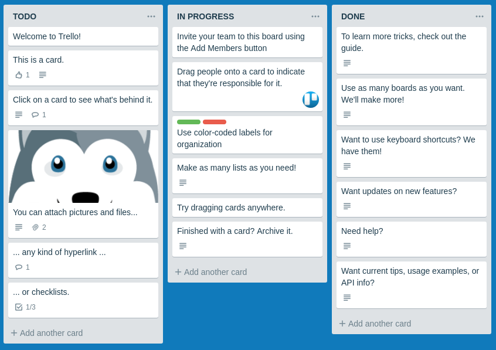
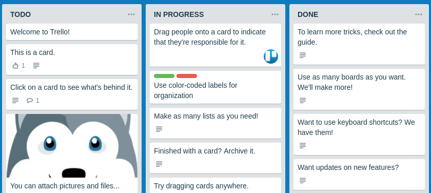

[https://finchik.github.io/dnd2/](https://finchik.github.io/dnd2/)

Правила сдачи задания:

1. **Важно**: в рамках этого ДЗ нужно использовать yarn (поэтому файла `package-lock.json` в репозитории быть не должно)
2. Всё должно собираться через Webpack (включая картинки и стили) и выкладываться на Github Pages через Appveyor
3. В README.md должен быть размещён бейджик сборки и ссылка на Github Pages
4. В качестве результата присылайте проверяющему ссылки на ваши GitHub-проекты
5. Авто-тесты писать не требуется

---

### Trello

#### Легенда

Вы делаете внутрикорпоративную систему управления задачами и вашему руководству очень нравится подход, который используется в [Trello](https://trello.com):

#### Описание

Фактически у вас есть доска, состоящая из колонок, в каждой колонке может быть несколько карточек.

Для упрощения сделаем следующие допущения:
1. Кол-во колонок фиксировано и равно 3
1. Новые колонки добавлять нельзя, удалять имеющиеся тоже
3. Перемещать колонки тоже нельзя

Что же можно:
1. Добавлять карточки с помощью кнопки 'Add another card'. Вот так это выглядит:

2. Удалять карточки - при наведении на карточку появляется иконка крестик ("\E951"), которая и удаляет карточку (обратите внимание в оригинальном Trello такой операции нет, есть только архивация, но мы для упрощения её ввели):

 
4. Перемещать карточки как внутри колонки, так и между колонками:

##### Процесс перемещения

1. Внешний вид до переноса (карточка находится на своём месте):

2. Внешний вид в момент переноса (карточка удаляется из своего начального положения):

Обратите внимание на следующие нюансы:
1. Внешний вид курсора ('grabbing')
2. Курсор по отношению к карточке остаётся там, где изначально схватили - не привязывается ни к левому краю, ни к центру, а там, где схватили карточку, т.е. можно схватить за нижний левый угол:

3. При наведении на другие позиции под карточку выделяется место по высоте равное размеру самой карточке, при это будет карточка ставится "до" или "после" элемента определяется исключительно позицией курсора:

##### Дополнительно

Дополнительные требования:
1. Храните всё состояние в LocalStorage так, чтобы после обновления страницы внесённые изменения сохранялись
1. Постоение DOM-дерева производите на базе состояния, хранящегося в LocalStorage

##### Упрощения

В целях упрощения сделайте только:
1. Возможность хранить текст (картинки, списки, цветовое оформление элементов не нужно)
2. Перемещение самой карточки (поворот делать не нужно)
3. Можете также не обрабатывать ситуацию, связанную с выносом элемента за пределы доски

---

### Modern Image Manager

#### Легенда

Менеджер картинок, который вы делали в 3-ей лекции нуждается в улучшении, в частности решили сделать две вещи:
1. Предоставить возможность загружать пользователю изображения с его компьютера (а не URL)
1. Совместить форму для Drag and Drop и окошко выбора файлов

#### Описание

Внешний интерфейс должен выглядеть следующим образом:

Схема работы:
1. При переносе изображения (Native DnD) с компьютера пользователя в блок Drag and Drop (т.е. из файлового менеджера переносим файл в окно браузера) должна происходить загрузка файла (если это изображение) и отображение его внизу (превью с крестиком)
1. При клике на блок Drag and Drop должна открываться стандартная форма выбора файлов (как для native `<input type="file">`) после выбора файла также должна происходить загрузка с отображение его внизу (превью с крестиком)

Обратите внимание: нужно, чтобы если пользователь два раза подряд выбрал один и тот же файл (не важно каким способом), этот файл оба раза загрузился и отображался внизу в превью (т.е. должно их быть два).

---

### Download Manager (задача со звёздочкой)

Важно: эта задача не является обязательной

#### Легенда

Вы делаете веб-интерфейс к облачному хранилищу данных (Dropbox, Google Drive, Yandex Disk, Mail.ru Облако), с которого можно скачивать книги (обратите внимание, никакого пиратского контента, только свободно распространяемый материал). И вам нужно реализовать интерфейс для скачивания средствами JS.

Подсказка: храните контент файлов предзашитым в виде DataURL в теле страницы (тяжёлые файлы специально убраны).

Но при этом также нужно показать пользователю, сколько мегабайт он уже скачал.

#### Описание

Внешний вид должен выглядеть следующим образом:

PDF-файлы для реализации вы найдёте в каталоге files данного репозитория.

Обратите внимание, что скачивание должно производиться средствами JS и подсчёт количества скачанных мегабайт должен производиться на базе реально скачанного контента (а не тех размеров, что указаны в табличке).

При этом если одна книжка скачивается дважды, то и учитываться в обьёме скачанного она должна также дважды.
